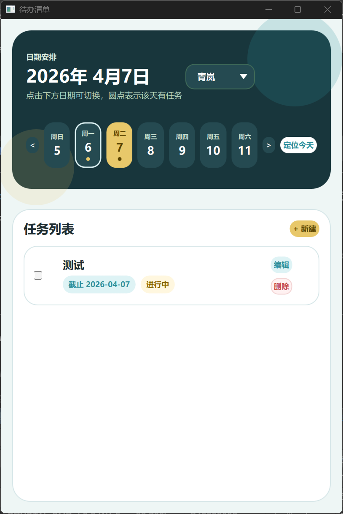
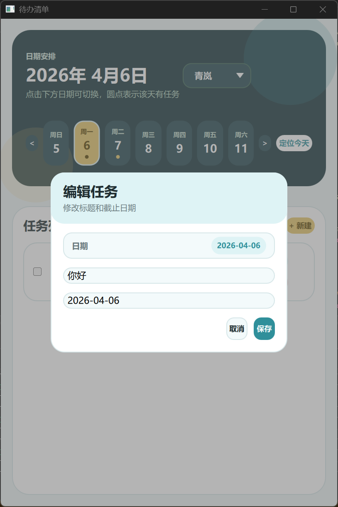
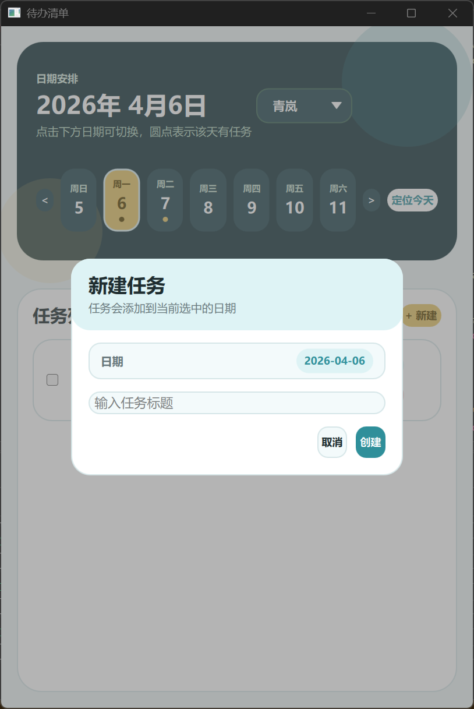

# Todo List Demo

一个基于 Qt Quick / QML 的待办事项示例项目。

当前版本已经完成：

- 使用 SQLite 进行任务持久化
- 基于 `QAbstractListModel` 向 QML 提供数据
- 支持按日期查看任务
- 支持任务新增、删除、编辑、完成状态切换
- 支持周视图和月历选择日期
- 支持多套界面主题切换

## 技术栈

- Qt 6
- QML / Qt Quick Controls
- SQLite
- `QSqlDatabase`
- `QSqlQuery`
- `QAbstractListModel`

## 项目结构

- `main.cpp`
  - 应用入口
  - 初始化数据库连接和数据表

- `todomodel.h`
  - 模型接口定义

- `todomodel.cpp`
  - 任务数据加载、数据库读写、过滤逻辑

- `todoitem.h`
  - 任务结构体

- `Main.qml`
  - 主界面

- `PROJECT_NOTES.md`
  - 当前项目实现说明和迭代记录

## 数据存储

任务数据使用 SQLite 存储。

数据库文件位置：

`data/todo.db`

主要数据表：

- `tasks`
- `app_meta`

## 当前功能

### 任务管理

- 新建任务
- 编辑任务标题和日期
- 删除任务
- 勾选完成状态

### 日期相关

- 选择当前日期
- 上一周 / 下一周切换
- 快速定位到今天
- 月历弹层选择日期
- 当前日期对应任务显示

### 界面

- 多主题切换
- 主题记忆
- 顶部周视图日期导航
- 有任务日期显示提示点

## 模型接口

QML 当前主要通过 `todoModel` 调用以下方法：

- `addItem(title, dueDate)`
- `removeItem(id)`
- `setCompleted(id, completed)`
- `setCurrentDate(date)`
- `updateTask(id, newTitle, newDueDate)`
- `hasTasksForDate(date)`

## 过滤逻辑

当前界面里的筛选模式和所选日期联动：

- `AllTasks`
  - 显示所选日期的全部任务

- `TodayTasks`
  - 显示所选日期的未完成任务

## 构建

项目使用 CMake。

依赖模块：

- `Qt6::Core`
- `Qt6::Quick`
- `Qt6::QuickControls2`
- `Qt6::Sql`

## 说明

- 数据库存储已经替代原来的 JSON 主存储
- 保留了旧 JSON 数据导入兼容逻辑
- 运行产生的 `data/todo.db` 属于本地数据文件，不建议直接提交到仓库

## 后续可继续优化

- 清理界面文案和样式细节
- 拆分 QML 组件
- 增加测试与构建验证
- 增加任务统计与更完整的日历体验
